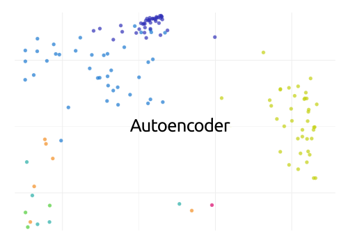

# Autoencoder
A simple autoencoder module for experimentation and dimensionality reduction. Supports automatic scaling



### Install and load
Install from npm:
```
npm install autoencoder
```

Then load with `require`:
```javascript
const Autoencoder = require('autoencoder')
```

### Create new autoencoder
`Autoencoder` supports two ways of a model initialization:
- Provide the number of layers, input size, encoder output size (number of latent variables) and the activation function name
```javascript
const ae = new Autoencoder({
  'nInputs': 10,
  'nHidden': 2,
  'nLayers': 2, // (default 2) - number of layers in each encoder/decoder
  'activation': 'relu' // (default 'relu') - applied to all, but the last layer
})
```
- Define each layer separately for both encoder and decoder
```javascript
const ae = new Autoencoder({
  'encoder': [
    {'nOut': 10, 'activation': 'tanh'},
    {'nOut': 2, 'activation': 'tanh'}
  ],
  'decoder': [
    {'nOut': 2, 'activation': 'tanh'},
    {'nOut': 10}
  ]
})
```

Activation functions: `relu`, `tanh`, `sigmoid`

As other neural nets, autoencoder is very sensitive to input scaling. To make it easier the scaling is enabled by default, you can control it with an extra parameter `scale` that takes `true` or `false`

### Train autoencoder
```javascript
ae.fit(X, {
  'batchSize': 100,
  'iterations': 5000,
  'method': 'adagrad', // (default 'adagrad')
  'stepSize': 0.01,
})
```

Optimization methods: `sgd`, `adagrad`, `adam`

### Encode, Decode, Predict
```javascript
const Y = ae.encode(X)
const Xd = ae.decode(Y)
const Xp = ae.predict(X) // Similar to ae.decode(ae.encode(X))
``://www.npmjs.com/package/autoencoder`
